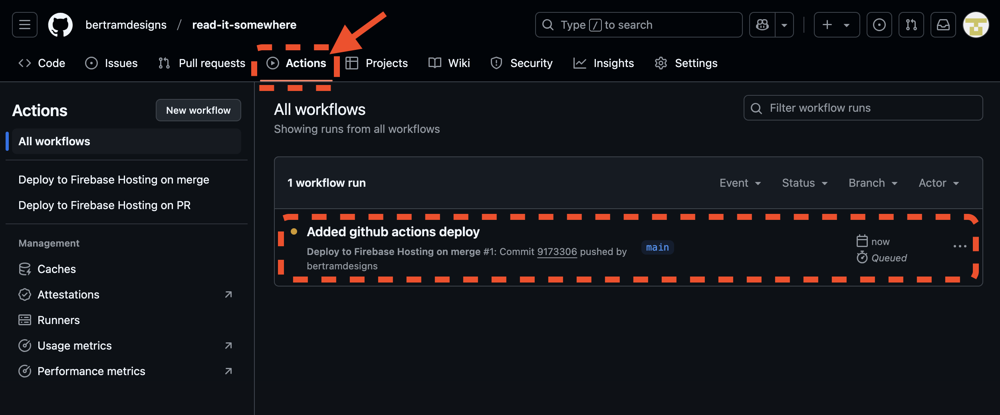
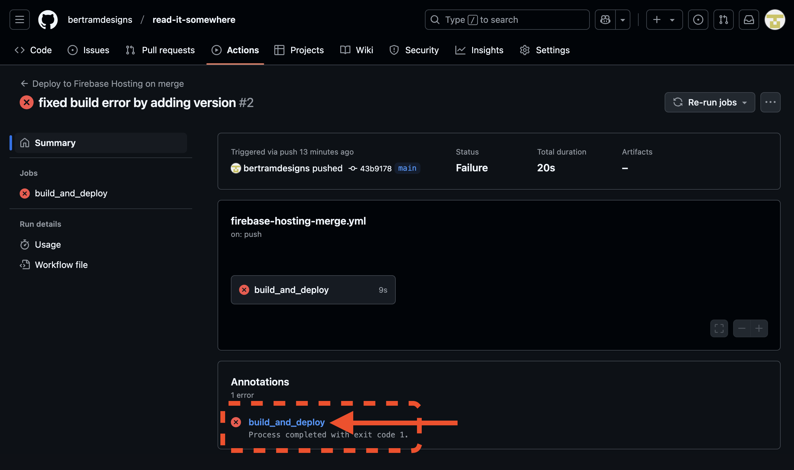
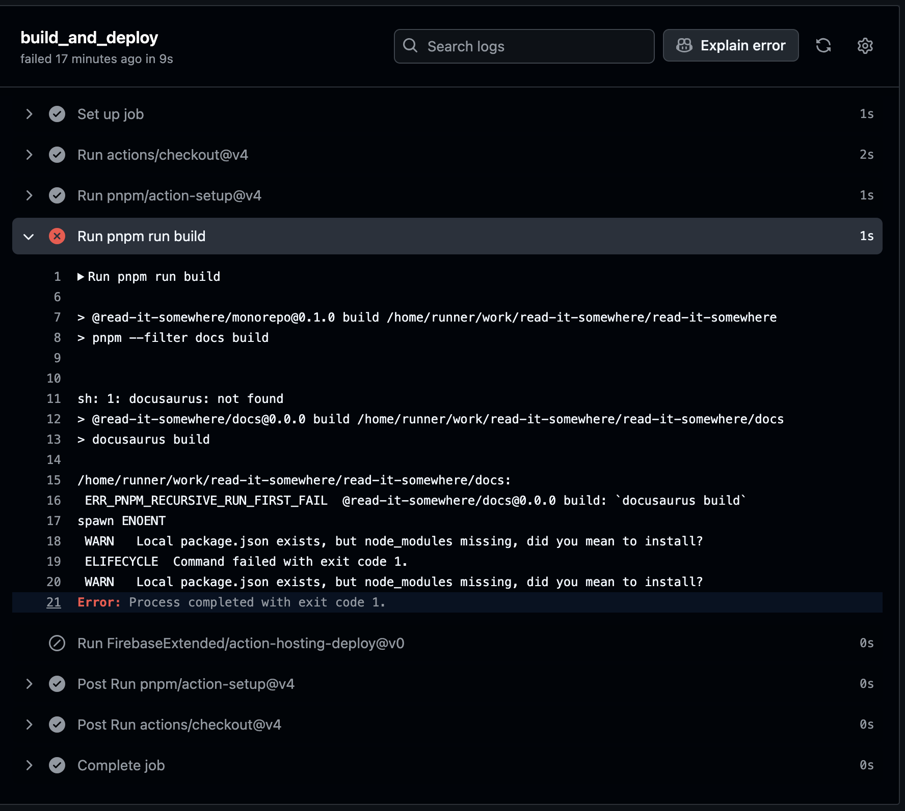

# Deploying with Github Actions

If you would like to automatically sync your Github repo with your site, you can use Github actions. Fortunately, the Firebase CLI makes this quite easy to setup.

[Official Docs](https://firebase.google.com/docs/hosting/github-integration)

### Install the Firebase CLI

If you have not already, install the CLI (Follow the [official docs](https://firebase.google.com/docs/cli#install_the_firebase_cli))

To see if it is installed, you can run the following command:

```bash
firebase --version
```

### Enter the project directory

Navigate to the project root directory in your terminal.

<details>
<summary>Monorepo</summary>

If you are using a monorepo, I recommend running all the following commands in the project directly, not the root of the monorepo. The `.github/workflows` folder will be created in the root of your repo anyway, but it ensures your firebase files stay in the project directory.

You will need to adjust the resulting workflow files to include an [entrypoint](https://docs.github.com/en/actions/writing-workflows/workflow-syntax-for-github-actions#jobsjob_idstepswithentrypoint) for the firebase step:

```yaml
name: Deploy to Firebase Hosting on merge
on:
  push:
    branches:
      - main
jobs:
  build_and_deploy:
    runs-on: ubuntu-latest
    steps:
      - uses: actions/checkout@v4
      - uses: pnpm/action-setup@v4
        with:
          version: 9
      - run: pnpm install
      - run: pnpm run build
      - uses: FirebaseExtended/action-hosting-deploy@v0
        with:
         // highlight-next-line
          entrypoint: /docs
          repoToken: ${{ secrets.GITHUB_TOKEN }}
          firebaseServiceAccount: ${{ secrets.FIREBASE_SERVICE_ACCOUNT_PROJECT_ID }}
          channelId: live
          projectId: your-project-id
```

</details>

### Initialize the project

Use the Firebase CLI to initialize the project for hosting.

Run `firebase init hosting:github` and select Hosting

:::warning[IF YOU HAVEN'T INITIALIZED HOSTING YET]
Before running this command, you should have already initialized your project for hosting. In your project root there should be `.firebacerc` and `firebase.json` files.

If not, run `firebase init hosting` and follow the prompts. You can choose to initialize with Github actions when doing this.

Follow the guide [Deploy with Firebase CLI](deploy-with-firebase-cli.mdx) for settings.
:::

---

You will be asked to authenticate your Github account and then select the repository you want to connect to.

```bash
? For which GitHub repository would you like to set up a GitHub workflow? (format: user/repository)
```

In my case, I am using `bertramdesigns/read-it-somewhere`.

---

If you need to set any .env variables for the deployment, you will set these up in github.

```bash
i You can manage your secrets at https://github.com/bertramdesigns/read-it-somewhere/settings/secrets.
```

Because deploying from Github to Firebase needs credentials, the CLI will add the required key for you.

---

```bash
? Set up the workflow to run a build script before every deploy? (y/N)
```

It is a good idea to answer `y` to this question. If you do not run the build script before deploying and you haven't committed the build files to your repo, the deployment likely fail.

---

```bash
? What script should be run before every deploy? (npm ci && npm run build)
```

You should check your `package.json` file to see what the build script is. In my case, it is `pnpm run build`.

If you have a monorepo, this would be your root package.json file pointing toward your project package.json.

<details>
<summary>Package managers other than NPM</summary>

Github actions automatically installs npm. If you are using pnpm, you will need modify your action files to use [pnpm/action-setup@v4](https://github.com/marketplace/actions/setup-pnpm).

In your `.github/workflows/` files, you will need to add the following before running the build script:

```yaml
build_and_deploy:
  steps:
    - uses: pnpm/action-setup@v4
      with:
        version: 9
```

If you choose to not specify the version in the action file, you must specify in the `package.json` file. Otherwise the build will fail. For example:

```json
"packageManager": "pnpm@9.12.3"
```

</details>

---

```bash
? Set up automatic deployment to your site's live channel when a PR is merged? (Y/n)
```

When you merge a pull request into main, this will automatically deploy the site. If you select `n`, you will need to manually run the action.

---

```bash
? What is the name of the GitHub branch associated with your site's live channel? (main)
```

Go to your repository and check the branch name. It is likely `main` or `master`. If you would like to deploy to preview channels, you'll need to setup a different workflow. [Info here](https://firebase.google.com/docs/hosting/manage-hosting-resources)

---

:::note[OPTIONAL]
Once you have completed the setup, you can revoke the Firebase CLI access to your Github account. It will likely give you the url once you have finished the setup.
:::

---

### Commit and push to Github

Commit the new files to a new branch and push to Github. Make sure the `.github/workflows` files and folders are committed. Then create a pull request and merge.

Alternatively, you can directly commit to the main branch.

### Check the actions

You will find your new actions in github under the Actions tab.



From here you can directly run the actions or check the logs. You will get an email when the deployment completes.

On all subsequent merges to the main branch, the actions will run and deploy. There should be a "preview URL" in each PR from now on.

It is not unusual for the first deployment to fail. If it does you can check the logs.

### Debug errors

Click on the workflow (it will have the latest commit message as name)

Select the debug message.



You will now see the logs and where the build failed.



Once you know what the error is, go back to your `.github/workflows/action-that-failed.yml` and make the necessary changes.

For this error we need to make sure to run a pnpm install before the build script.

### Other notes

You may notice in your logs the following:

```bash
  npm warn exec The following package was not found and will be installed: firebase-tools@13.29.3
```

This does auto resolve by installing the package, but it can be avoided by including the firebase-tools in your `package.json` file.
