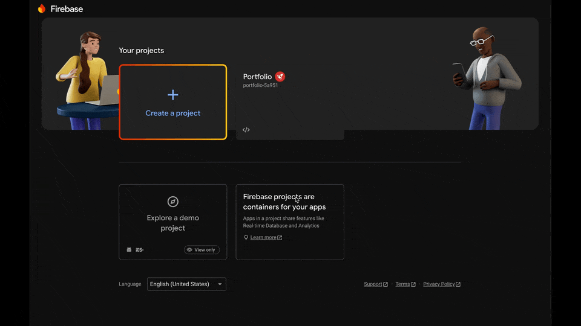
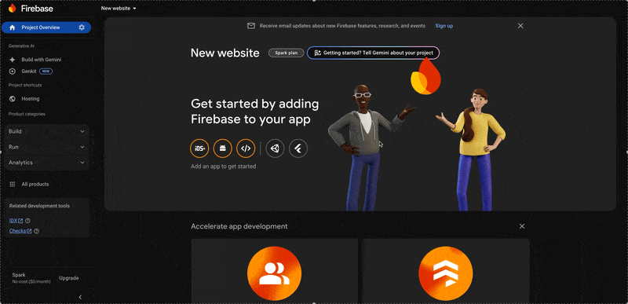

# Hosting

Firebase is a great option for hosting small, static sites. It is easy to set up and has a generous free tier (Spark).

**IN PROGRESS**
For now, follow the official [Get Started](https://firebase.google.com/docs/hosting/quickstart) guide

### Create a new project

First step is to head over to the [Firebase Console](https://console.firebase.google.com/) and create a new project.

### Setup Hosting

Once you have created a project, on the dashboard you need to select "Hosting"

Find this under "All Products" -> "Hosting" or under "Build" -> "Hosting".

:::warning
You are looking for "Hosting" not "App Hosting"
:::

### Deploy

The next step is to deploy your project files to Firebase. Follow the [deploy guide](/docs/firebase/deploy) for more information.