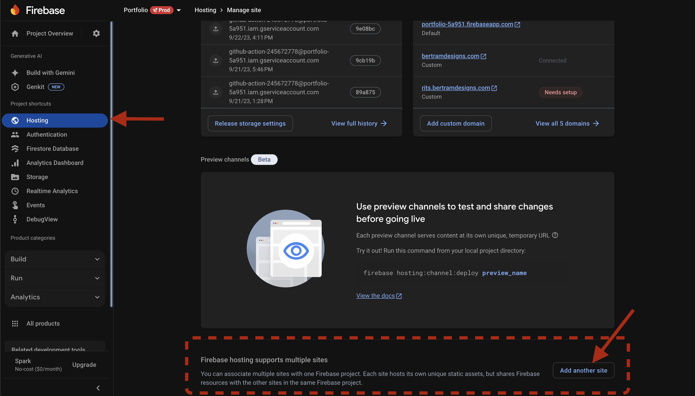
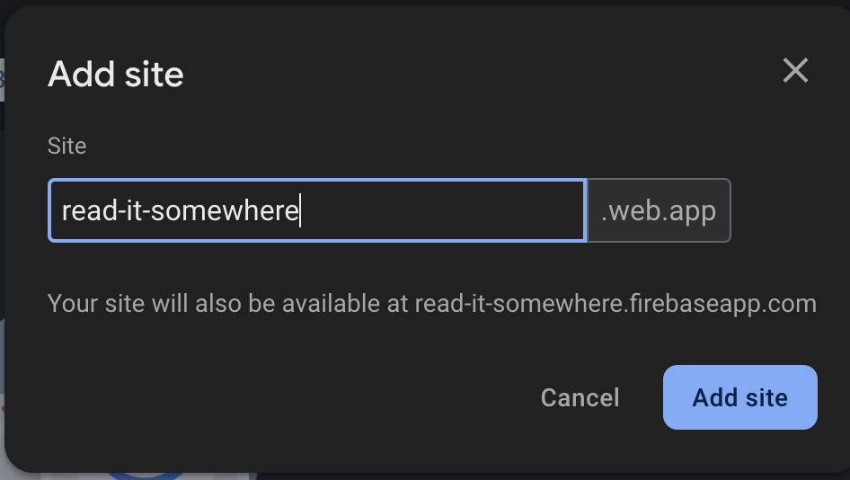
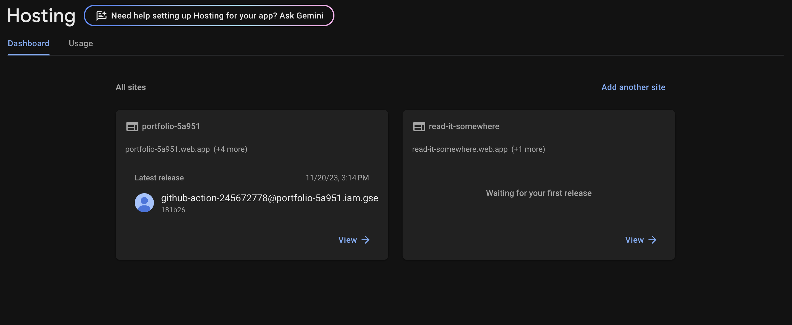

# Add a Site

Go to the Firebase Console -> 'your-project' -> Hosting -> Add another site



## Enter the site name

The project name is not the same as adding a domain. You will need to add in the domain redirect later. This is important to understand because there is a length limit. For example, I tried to add `rits` and it was too short so instead I use the full name `read-it-somewhere` and redirect using the custom domain settings.



## Back to the Hosting tab

Once you add the site, there isn't a clear way to see it. You'll need to select the hosting tab again. This will then present you with both sites.



## Deploy the new site

Now you can deploy the new site with the cli.

### Login to Firebase in the CLI

The first thing we need to do is login to Firebase.

```bash
firebase login
```

<details>
<summary>Problem with the CLI?</summary>

Check that you have your CLI setup properly.

```bash
firebase --version
```

If you don't have it installed, you can install it with npm or globally.
Instructions [here](https://firebase.google.com/docs/cli)

Shortcut to install:

```bash
npm install -g firebase-tools
```

</details>
<details>
<summary>If it has been a while since you logged in...</summary>

Sometimes the auth token expires, but says you are still logged in. If there has been a version update this can happen.

The best thing to do is to first logout and then login again. This will usually clear up most of the errors.

```bash
firebase logout
firebase login
```

</details>

### Initialize the project

Now initalize the project and follow the prompts. You'll be setting it up as Hosting into the existing project where you placed your new site. In my case, I am choosing my portfolio project id.

```bash
firebase init
```

:::note
If you have a mono-repo, you will need to initialize the project in the directory of the site you want to deploy, NOT the root of the repo. Add a deployment script to your package.json to make it easier to deploy.

This is to reduce problems in github actions setup later.
:::

<details>
<summary>Common questions</summary>

Q: I can't see the site I just added to Firebase Console.
A: This is because we are selecting the PROJECT not the site. We will handle the target site later.

Q: What do you want to use as your public directory?
A: When you build your project, it will create a folder with all the files. This is the name of the public directory. In my case, it is `build`.

Q: Configure as a single-page app (rewrite all urls to /index.html)?
A: If your build files have a bunch of index.html files it is not an SPA. If you have a static site generator (like Docusaurus) you will want to answer `No`.

</details>

<details>
<summary>Example prompt flow</summary>

```bash
? Which Firebase features do you want to set up for this directory?
Press Space to select features, then Enter to confirm your choices.
- Hosting: Configure files for Firebase Hosting and (optionally) set up GitHub Action deploys

=== Project Setup

First, let's associate this project directory with a Firebase project.
You can create multiple project aliases by running firebase use --add,
but for now we'll just set up a default project.

? Please select an option: Use an existing project
? Select a default Firebase project for this directory: portfolio-5a951 (Portfolio)
i  Using project portfolio-5a951 (Portfolio)

=== Hosting Setup

Your public directory is the folder (relative to your project directory) that
will contain Hosting assets to be uploaded with firebase deploy. If you
have a build process for your assets, use your build's output directory.

? What do you want to use as your public directory? build
? Configure as a single-page app (rewrite all urls to /index.html)? No
? Set up automatic builds and deploys with GitHub? (y/N) No
```

</details>

If you have already built your project, you probably already have a `./build`folder with `index.html` and `404.html`. You should choose to not overwrite these files. If you do, it is no big deal. Just rebuild. You may also need to add some analytics script tags too.

```bash
? File build/404.html already exists. Overwrite? No
i  Skipping write of build/404.html
? File build/index.html already exists. Overwrite? No
i  Skipping write of build/index.html
```

### Configure the deployment to the new site

You'll notice that the CLI placed the `firebase.json` and `.firebaserc` files in the root of the project. This is where the configuration for the deployment is stored.

In the `firebase.json` file we need to add the site we added earlier. If you haven't deployed, you can see this if you go to the Firebase Console -> Hosting -> your-site -> Previous releases -> Instructions.

But the name on your the site card is the correct name. In my case it's `read-it-somewhere`.

```json
{
  "hosting": {
    "site": "read-it-somewhere",
    "public": "build",
    "ignore": ["firebase.json", "**/.*", "**/node_modules/**"]
  }
}
```

### Deploy the site

Now you can deploy the site.

```bash
firebase deploy --only hosting:read-it-somewhere
```

If you are using a mono-repo, you must deploy from the directory of the site you want to deploy or add a deployment script to your package.json.

:::tip[Looking to deploy with Github Actions?]
Read the tutorial under Firebase -> [Github Actions](deploy-with-github-actions.md) to set up a Github Action to deploy your site.
:::
