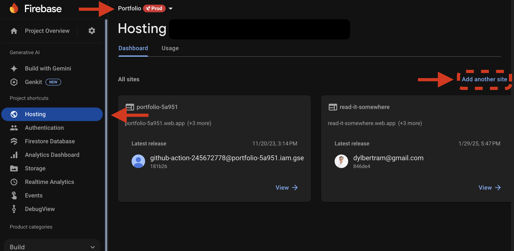
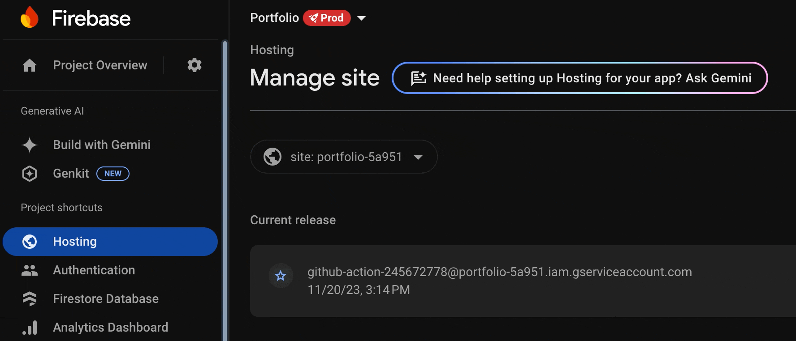

# Add a Site

### Choose a project

Go to the Firebase Console -> 'your-project'

Select the hosting tab on the left sidebar.

If you have not added a second site yet, you can find the "Add Another site" at the bottom of the page.

If you have already added a second site, you will find it on the hosting tab, before you select a site, at the top right of the page.

You can also find it at the top of the site management page in the dropdown.

### Enter the site name

The project name is not the same as adding a domain. You will need to add in the domain redirect later.

This is important to understand because there is a length limit. For example, I tried to add `rits` and it was too short so instead I use the full name `read-it-somewhere` and redirect using the custom domain settings.

In theory you could name your site whatever you want and redirect to the proper name later... but that would be silly and confusing.

### Select your new site

Once you add the site, there isn't a clear way to see it. There are two options:

Select the hosting tab again. This will then present you with both sites.

Alternatively, you can scroll to the top of the page and select the site from the dropdown.

