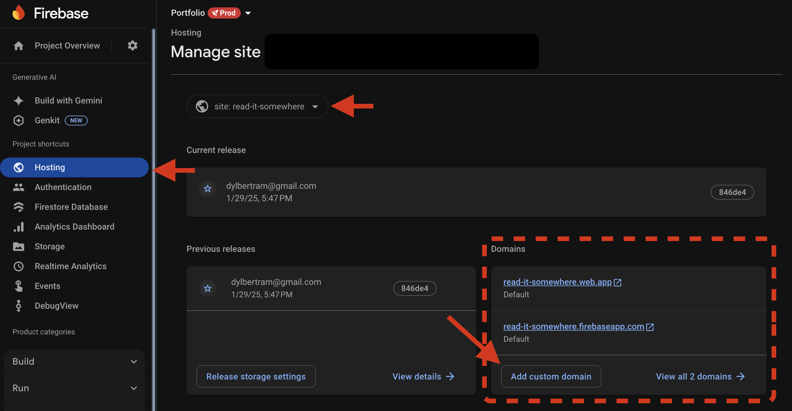
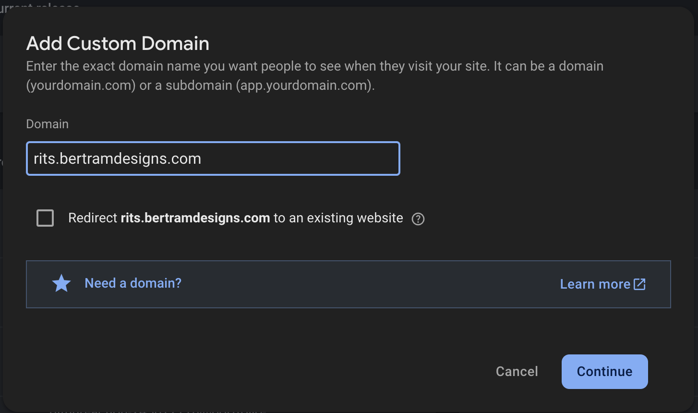
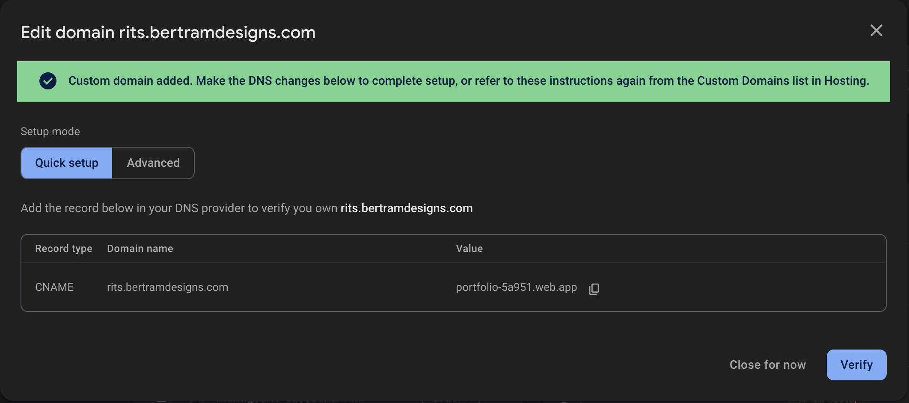
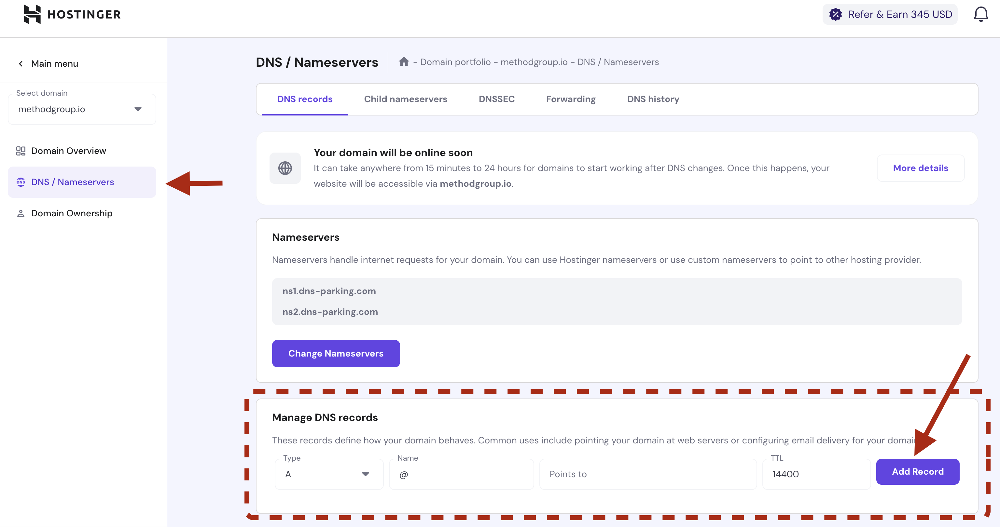

# Setup the Subdomain

## Creating a subdomain

[Official Docs](https://firebase.google.com/docs/hosting/custom-domain)

### Go to the Firebase Console -> 'your-project' -> Hosting

### Click 'Add custom domain'

### Enter the subdomain you want to use, including the domain name.

You can choose to redirect here as well. So for example, if I wanted to redirect `ris.bertramdesigns.com` to `rits.bertramdesigns.com`, I would check the box to Redirect.

If you are setting up the subdomain, you will then need to add to your DNS records.

This will supply you with the DNS records you need to add to your domain provider.

:::tip
If you need to transfer the domain for any reason, you can "close for now" and it will give you a "needs setup" tag for you to fix later.
:::

### Add the DNS records to your domain provider

I use Hostinger so I would go to Hostinger, select the domain, and add the records there.

Note: the quick setup suggests adding a CNAME record for the subdomain. This won't work if you have other records pointing toward a mail server. Use the Advanced setup instead and add the TXT and setup the SSL certificate. More information [here](https://firebase.google.com/docs/hosting/custom-domain#expandable-2)
